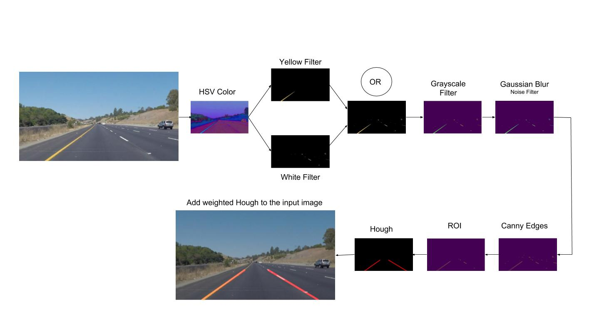

# **Finding Lane Lines on the Road** 

---

The goal of the project is to find the lane lines on the road in the images 
using OpenCV-Python library.  A processing pipeline was designed similar to 
the one presented during the class. 

---

### Reflection

### 1. Pipeline

The pipeline consists of 10 steps. The diagram is presented in *Figure 1*

Here are the bigger images from *Figure 1* 

##### Convert the image to HSV color space

##### Convert the image to HSV color space

##### Convert the image to HSV color space

##### Convert the image to HSV color space

##### Convert the image to HSV color space

##### Convert the image to HSV color space

##### Convert the image to HSV color space

##### Convert the image to HSV color space

In order to draw a single line on the left and right lanes, I modified the draw_lines() function by ...

If you'd like to include images to show how the pipeline works, here is how to include an image: 

### 2. Identify potential shortcomings with your current pipeline

One potential shortcoming would be what would happen when ... 

Another shortcoming could be ...

### 3. Suggest possible improvements to your pipeline

A possible improvement would be to ...

Another potential improvement could be to ...
