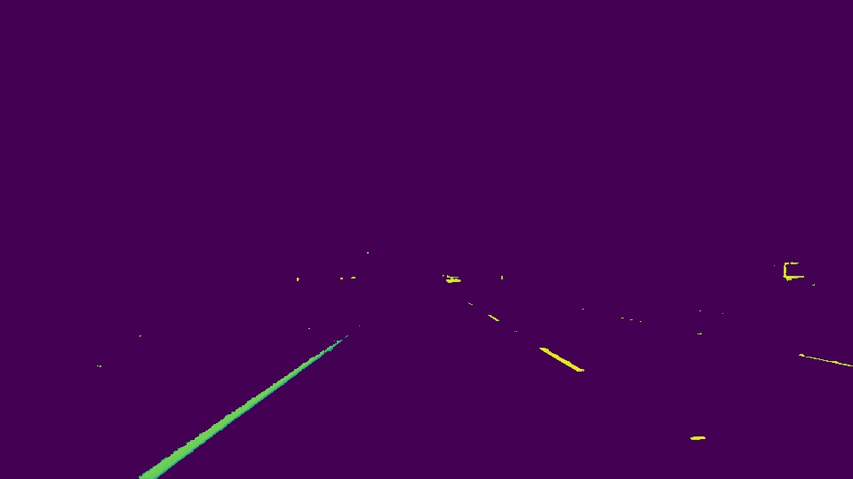
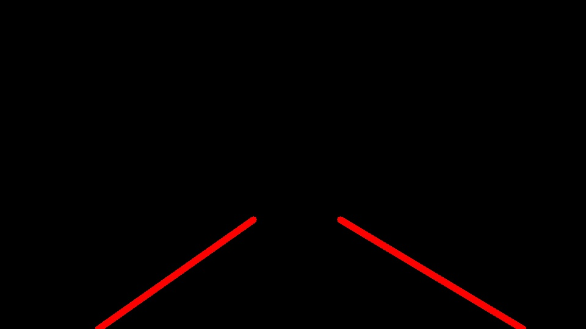
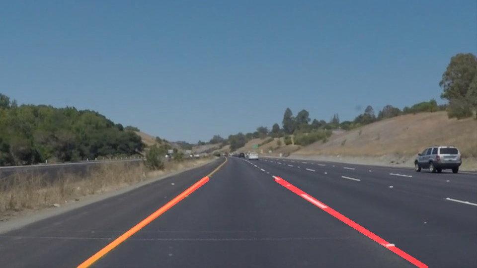

# **Finding Lane Lines on the Road** 

---

The goal of the project is to find the lane lines on the road in the images 
using OpenCV-Python library.  A processing pipeline was designed similar to 
the one presented during the class. 

---

### Reflection

### 1. Pipeline

The pipeline consists of 10 steps. The diagram is presented in *Figure 1*

Here are the bigger images from *Figure 1* 

##### Original image

##### Convert the image to HSV color space

##### Apply Yellow filter to the HSV image 

##### Apply White filter to the HSV image 

##### Bitwise OR of Yellow and White results

##### Apply gray scale to the result of OR

##### Apply Gaussian Blur to reduce the noise

##### Select Region of Interest (ROI) on the image.  Black out everything else.

##### Apply Hough transform to find the lines

##### Add weighted Hough lines to the original image

In order to draw the lane lines in draw_lines() function, I 'split' the Hough lines 
into the left and right sets based on whether both x-coordinates of each line 
fell on the left or the right half of the image.  While adding the lines to either set, 
I filtered out the ones whose slope did not fall into a reasonable range.  This was done to 
avoid any lines that might be perpendicular to the direction of travel.

Further, I extrapolated the lines using OpenCV *polyFit* function.  *polyFit* seems to have produced
better results compared to averaging the slopes.  However, when the data (white line markings) got sparse, 
I got some lines fitted across the road.  As a back up for this case, I left averaging method in place.
See *extrapolate_line()*.

### 2. Potential improvements to the pipeline

I noticed that my yellow/white filter is a bit too aggressive.  It filters out most of the non-line feature 
such as hill sides.  Had the road markings been less bright, I would miss the lines altogether.  So, perhaps
widening the white and yellow ranges is in order. 

I have not tested the performance of the pipeline.  It might not be scalable to a real situation with so many 
steps.  Also, I wonder if I could apply Region Of Interest step earlier and if it would save some processing speed. 

